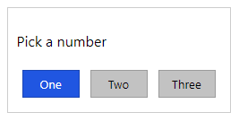

<div align="center">
  
  <h1>Pops</h1>
  <p>Create simple and highly customizable pop-up messages for your website</p>
</div>
<hr>

[](https://www.gnu.org/licenses/gpl-3.0.en.html)

## Table of contents

- [Setup](#setup)
- [How it works](#how-it-works)
    - [Create a new Pops object](#create-a-new-pops-object)
    - [Alert](#alert)
    - [Confirm](#confirm)
    - [Prompt](#prompt)
    - [Custom pop-up](#custom-pop-up)
    - [Form](#form-using-custom-function)
- [Customize your pop-ups](#customize-your-pop-ups)
- [Actual example of Pops use](#actual-example-of-pops-use)

## Setup
In your HTML code insert the following stylesheet and javascript tags.

```html
<link rel="stylesheet" href="pops.css">
```

```html
<script src="pops.js"></script>
```
That's it, now you are ready to use Pops

## How it works

### Create a new Pops object
```js
const POP = new Pops();
```

You can now use **POP** to display pop-up windows of all kinds.

### Alert
```js
POP.alert("Hello world");
```
This result in the following pop-up:


Note that all pop-ups return a promise, so the best way to use Pops is by await/async

```js
await POP.alert("Hello world");
console.log("You clicked OK"); // This will not be executed until you click OK in the pop-up window.
```

### Confirm
```js
POP.confirm("Do you want to continue?");
```
Result:


Again, the correct way to use this function is with async/await

```js
if (await POP.confirm("Do you want to continue?"))
    // User clicked OK
else 
    // User clicked Cancel
```

### Prompt
```js
POP.prompt("Please enter your name");
```
Result:


Using async/await:
```js
let name = await POP.prompt("Please enter your name");
console.log("Hello there " + name);
```

Note that selecting Cancel will return null

### Multiple choices
```js
POP.choice("Pick a number", ["One", "Two", "Three"]);
```
Result:



Using async/await:
```js
const choice = await POP.choice("Pick a number", ["One", "Two", "Three"]);
switch(choice){
    case 0:
        console.log("You selected one");
        break;
    case 1:
        console.log("You selected two");
        break;
    case 2:
        console.log("You selected three");
        break;
}
```

### Custom pop-up
```js
POP.custom([
    {
        "Element": "h1",
        "InnerText": "Custom pop-up"
    },
    {
        "Element": "p",
        "InnerText": "This is how you build your own pop-up"
    },
    {
        "Element": "button",
        "InnerText": "Ok",
        "Attributes": {
            "Class": "primary",
            "Style": "float: right",
            "Return": 0
        }
    },
    {
        "Element": "button",
        "InnerText": "Cancel",
        "Attributes": {
            "Style": "float: right",
            "Return": 1
        }
    }
])
```
Result:


Using async/await:
```js
const data = await POP.custom([
    {
        "Element": "h1",
        "InnerText": "Custom pop-up"
    },
    {
        "Element": "p",
        "InnerText": "This is how you build your own pop-up"
    },
    {
        "Element": "button",
        "InnerText": "Ok",
        "Attributes": {
            "Class": "primary",
            "Style": "float: right",
            "Return": 0
        }
    },
    {
        "Element": "button",
        "InnerText": "Cancel",
        "Attributes": {
            "Style": "float: right",
            "Return": 1
        }
    }
]);

switch(parseInt(data["Return"])){
    case 0:
        console.log("You clicked Ok");
        break;
    case 1:
        console.log("You clicked Cancel");
        break;
}
```

### Form using custom function
```js
POP.custom([
{
    "Element": "label",
    "InnerText": "Username:"
},
{
    "Element": "input",
    "Attributes": {
        "Property": "Username",
    }
},
{
    "Element": "label",
    "InnerText": "Password:",
},
{
    "Element": "input",
    "Attributes": {
        "Property": "Password",
        "Type": "password"
    }
},
{
    "Element": "button",
    "InnerText": "Log in",
    "Attributes": {
        "Class": "primary",
        "Return": 0
    }
},
{
    "Element": "button",
    "InnerText": "Cancel",
    "Attributes": {
        "Return": 1
    }
}
])
```
Result:


Using async/await:
```js
const data = await POP.custom([
    {
        "Element": "label",
        "InnerText": "Username:"
    },
    {
        "Element": "input",
        "Attributes": {
            "Property": "Username",
        }
    },
    {
        "Element": "label",
        "InnerText": "Password:",
    },
    {
        "Element": "input",
        "Attributes": {
            "Property": "Password",
            "Type": "password"
        }
    },
    {
        "Element": "button",
        "InnerText": "Log in",
        "Attributes": {
            "Class": "primary",
            "Return": 0
        }
    },
    {
        "Element": "button",
        "InnerText": "Cancel",
        "Attributes": {
            "Return": 1
        }
    }
])

switch(parseInt(data["Return"])){
    case 0:
        console.log("The username you entered is: " + data["Properties"]["Username"]);
        console.log("The password you entered is: " + data["Properties"]["Password"]);
        break;
    case 1:
        console.log("You clicked Cancel");
        break;
}
```

## Customize your pop-ups
If you want your pop-up window to be styled differently, just specify the name of the custom class when creating the object

```js
const POP = new Pops("custom-class");
```
```css
.custom-class{
    border-radius: 5px;
    padding: 10px;
    font-family:'Segoe UI', Tahoma, Geneva, Verdana, sans-serif;
    background-color: rgb(5, 12, 32);
    color: rgb(162, 184, 255);
}

.custom-class button {
    min-width: 64px;
    background-color: rgb(25, 50, 80);
    color: white;
    border: 0;
    padding: 4px;
    margin: 6px;
}

.custom-class .primary{
    background-color: rgb(118, 170, 230);
    color: black;
}
```
Result:


## Actual example of Pops use
I am using Pops to facilitate pop-up management in my applications:
- [Libre Lists](https://github.com/AdrBog/LibreLists)
- [Other Apps](https://github.com/AdrBog/OtherApps)

All pop-up windows you will see in Libre Lists will be one created by Pops.
